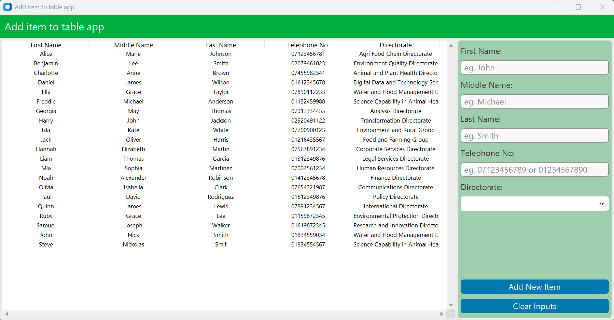
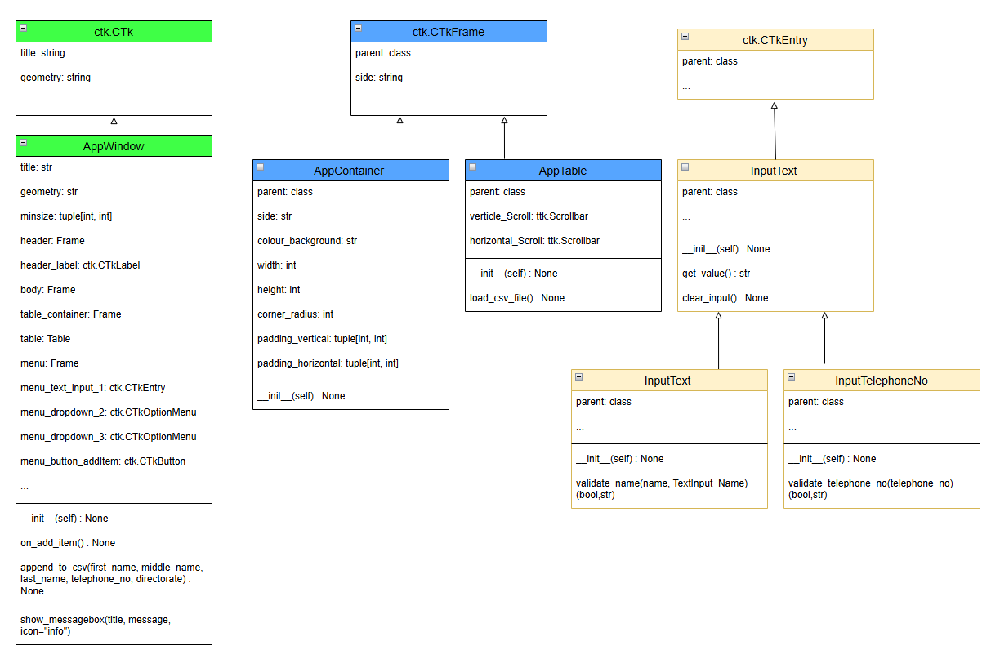

# Add item to table app Application Documentation

Welcome to the Add item to table app Application repository! This Tkinter-based GUI application allows users to enter a row into a table.

## Table of Contents
- [Introduction](#introduction)
- [Design](#design)
  - [GUI Design](#gui-design)
    - [Screen mockups](#screen-mockups)
  - [Requirements Document](#requirements-document)
    - [Functional Requirements](#functional-requirements)
    - [Non-Functional Requirements](#non-functional-requirements)
  - [Tech Stack Outline](#tech-stack-outline)
  - [Code Design Document](#code-design-document)
- [Testing Strategy](#testing-strategy)
- [References](#references)

# Introduction

I work at DEFRA, the Department for the Environment, Food and Rural Affairs.  DEFRA is a large government department responsible for safeguarding the natural environment, supporting farming and protecting the countryside.  Within DEFRA I work in a small business support team where my role is to use Microsoft power platform tools such as PowerApps, Power BI and Power Automate to improve the efficiency of the teams we support.  One of our teams’ tasks is to find people to be seconded when needed, the problem is that the data is scattered across multiple locations and is inconsistent, the “Add Item to Table App” is designed to solve this problem.

DEFRA’s corporate structure is sprawling, massive and ever changing, it is split into Director General areas, then directorates, then teams.  The organisation is a massive bureaucracy with a heavy emphasis on compliance making it unwieldy and inefficient.  To counter this the Digital Data and Technology Service, DDTS, are pushing a strategy to promote automation, innovation and data integrity.  Currently a lot of processes rely on data in an Excel file on someone’s desktop or data within an external companies database which we aren’t allowed to access.

Our team need to find people with certain skills, location and other variables to be seconded into emergency roles, the problem is that this takes a lot of time and is inefficient.  The data is spread around in different places, in some places the data is duplicated or inconsistent.  This whole process is much more time consuming than it needs to be due to the difficulty finding the data along with the time lost verifying it is correct.  Overall, this is not just a technical issue but also requires people to change how they work.

The proposed solution is a Python- based graphical user interface (GUI) application developed using Tkinter and CustomTkinter.  The application will serve as a centralised platform for data entry and data management, enabling users to input the required information easily and efficiently.  The application will also involve integrated data validation such as pattern checking using regular expressions for formatting names or phone numbers.  Input validation ensures standardised entries such as capitalised names or phone numbers in the correct formats.  This approach supports data integrity while providing an intuitive interface that enhances user experience while minimising input errors.  Attention will also be placed making the application accessible, for example, using a 4.5:1 contrast.

The data validation improves data integrity and saves time that would be spent correcting the data.  It also aligns with DEFRAS data governance and accessibility standards along with DDTS’s strategy to promote automation and data integrity.  There is also potential to integrate the app with other department systems such as Power Automate or Power BI.

On reflection it is important to involve the future users of the application when creating it as early as possible to make sure you are making something they want.  It is also a good idea to keep the code modular as to limit the amount of rework when something is changed.

In conclusion this project demonstrates innovation and aligns with DEFRA’s strategies.  

# Design

## GUI Design

### Screen mockups

The app was prototyped using [Figma](https://www.figma.com/design/PMYPoYa4koSNLf0LBXGbHx/Apps?node-id=4001-2960&p=f&t=P8jyBnSRsRnxKFNO-0).

## Requirements Document

### Functional Requirements

- The application shall display a window titled "Add item to table app".
- The application window shall have dimensions 1200x600 pixels.
- The background color of the application window shall be white or dark grey depending on light mode.
- The application shall display a label with the text "Enter a new item".
- The application shall provide an input field for the user to enter information for 3 rows.
- The application shall provide a "Submit" button. When clicked, the button shall trigger the action to save the item to a table.
- The appliation shall have appropriate data input such as dropdowns or text input.

#### Future Functional Requirements
 - Incluse a day night mode
 - The application shall allow deleting of items.
 - Show and hide add item bar.

#### Future Accessibility Requirements
  - Font and text resizing
  - Colour changes for specific types of colourblind or 

### Non-Functional Requirements

- The application shall have an intuitive and user-friendly interface.
- The application shall respond to user input within 1 second.
- The application shall handle invalid input gracefully without crashing.
- The application code shall be well-structured and documented.
- The application shall run on any system that supports Python and Tkinter.
- The application shall use appropriate font sizes and color contrasts for readability.
- The application design shall allow for easy addition of new features.

#### Accessibility Requirements

 - All text and interactive elements shall maintain a minimum 4.5:1 colour contrast ratio against their background, in accordance with WCAG 2.1 AA standards.
 - All screens shall maintain consistent navigation and layout.

#### Future Non-Functional Requirements
  - I would like this to change when the screen size changes not just on loading the data

## Tech Stack Outline

*describe the technologies you will use*

## Code Design Document

*Code Design Document: provide a class diagram or similar documentation to
illustrate your code design.*

The code design is summarised in the class diagram below.

The `App_Window` class inherits from the `ctk.CTk` class, which provides the foundational GUI window functionality. This inheritance allows `App_Window` to use and extend the methods and attributes of `ctk.CTk` to create a customised application window with specific features.  All the other classes are placed inside this class.

The `Frame` and `Table` class inherits from the `ctk.CTkFrame` class, which provides foundational responsive component functionality. This inheritance allows `Frame` and `Table` to be placed inside themselves in order to create a reponsive app. `Frame` is extended with flaxible layout and colour option and `Table` is extended with an interactive tkinter table.

# Testing Strategy

*Write a coherent strategy for testing your application. Explain what types of testing
you will use to test your MVP. Note that the second summative assignment requires
writing some unit tests using a Python framework. (500 words +/- 10%)*

### References
[customtkinter documentation](https://customtkinter.tomschimansky.com/documentation/appearancemode)  
[Adding a table](https://github.com/TomSchimansky/CustomTkinter/discussions/431)
