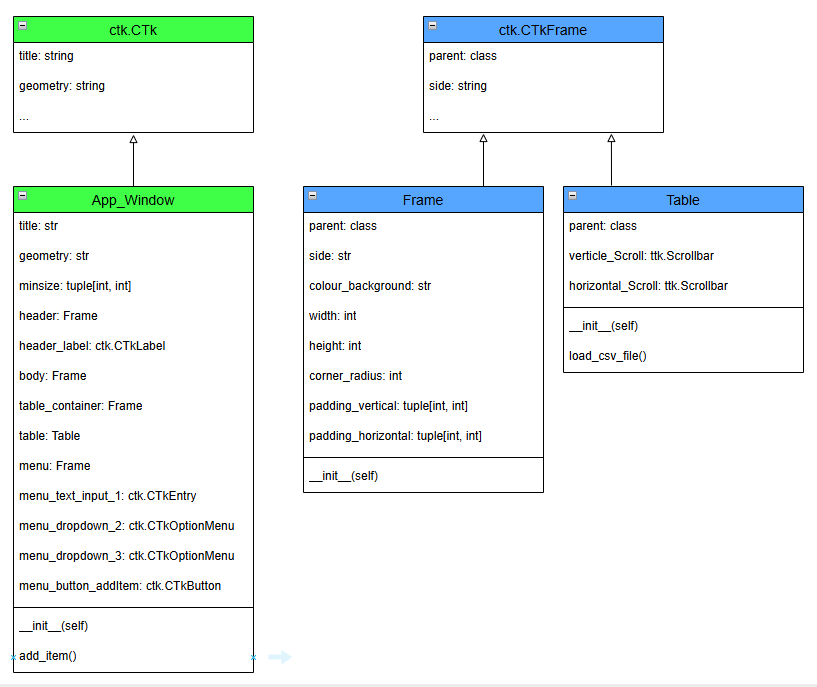

# Add item to table app Application Documentation

Welcome to the Add item to table app Application repository! This Tkinter-based GUI application allows users to enter a row into a table.

## Table of Contents
- [Introduction](#introduction)
- [Design](#design)
  - [GUI Design](#gui-design)
    - [Screen mockups](#screen-mockups)
  - [Requirements Document](#requirements-document)
    - [Functional Requirements](#functional-requirements)
    - [Non-Functional Requirements](#non-functional-requirements)
  - [Tech Stack Outline](#tech-stack-outline)
  - [Code Design Document](#code-design-document)
- [Testing Strategy](#testing-strategy)
- [References](#references)

# Introduction

*Provide a concise overview of your workplace environment and explain the relevance of your proposed MVP to your employer. (500 words +/- 10%)*

# Design

## GUI Design

*GUI Design: create a GUI design using Figma or another prototyping tool.  Include screenshots and optionally provide a link to your Figma design. The design should be specific to your application.*

### Screen mockups

The app was prototyped using [Figma](https://www.figma.com/design/PMYPoYa4koSNLf0LBXGbHx/Apps?node-id=4001-2960&p=f&t=P8jyBnSRsRnxKFNO-0).

## Requirements Document

### Functional Requirements

- The application shall display a window titled "Add item to table app".
- The application window shall have dimensions 1200x600 pixels.
- The background color of the application window shall be white or dark grey depending on light mode.
- The application shall display a label with the text "Enter a new item".
- The application shall provide an input field for the user to enter information for 3 rows.
- The application shall provide a "Submit" button. When clicked, the button shall trigger the action to save the item to a table.
- The appliation shall have appropriate data input such as dropdowns or text input.

#### Future Functional Requirements
- Incluse a day night mode
- The application shall allow deleting of items.
- Show and hide add item bar.

#### Future Accessibility Requirements
- Font and text resizing
- Colour changes for specific types of colourblind or 

### Non-Functional Requirements

- The application shall have an intuitive and user-friendly interface.
- The application shall respond to user input within 1 second.
- The application shall handle invalid input gracefully without crashing.
- The application code shall be well-structured and documented.
- The application shall run on any system that supports Python and Tkinter.
- The application shall use appropriate font sizes and color contrasts for readability.
- The application design shall allow for easy addition of new features.

#### Accessibility Requirements

- All text and interactive elements shall maintain a minimum 4.5:1 colour contrast ratio against their background, in accordance with WCAG 2.1 AA standards.
- All screens shall maintain consistent navigation and layout.

#### Future Non-Functional Requirements
- I would like this to change when the screen size changes not just on loading the data

## Tech Stack Outline

*describe the technologies you will use*

## Code Design Document

*Code Design Document: provide a class diagram or similar documentation to
illustrate your code design.*

The code design is summarised in the class diagram below.

The `App_Window` class inherits from the `ctk.CTk` class, which provides the foundational GUI window functionality. This inheritance allows `App_Window` to use and extend the methods and attributes of `ctk.CTk` to create a customised application window with specific features.  All the other classes are placed inside this class.

The `Frame` and `Table` class inherits from the `ctk.CTkFrame` class, which provides foundational responsive component functionality. This inheritance allows `Frame` and `Table` to be placed inside themselves in order to create a reponsive app. `Frame` is extended with flaxible layout and colour option and `Table` is extended with an interactive tkinter table.

# Testing Strategy

*Write a coherent strategy for testing your application. Explain what types of testing
you will use to test your MVP. Note that the second summative assignment requires
writing some unit tests using a Python framework. (500 words +/- 10%)*

### References
[customtkinter documentation](https://customtkinter.tomschimansky.com/documentation/appearancemode)  
[Adding a table](https://github.com/TomSchimansky/CustomTkinter/discussions/431)
